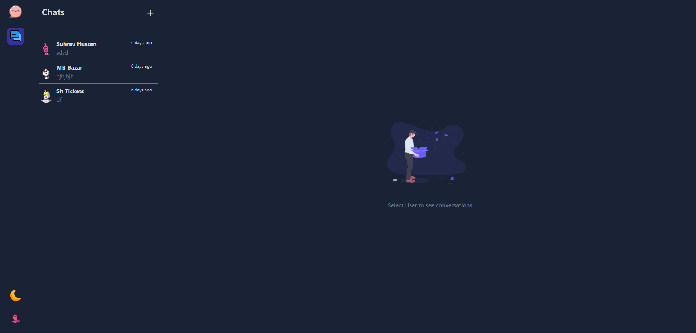
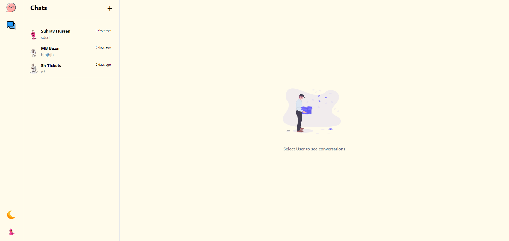
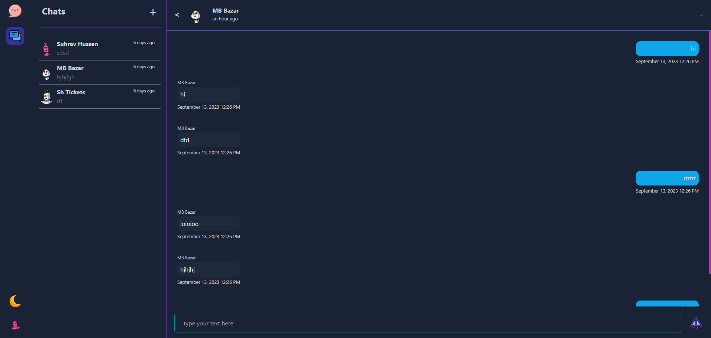
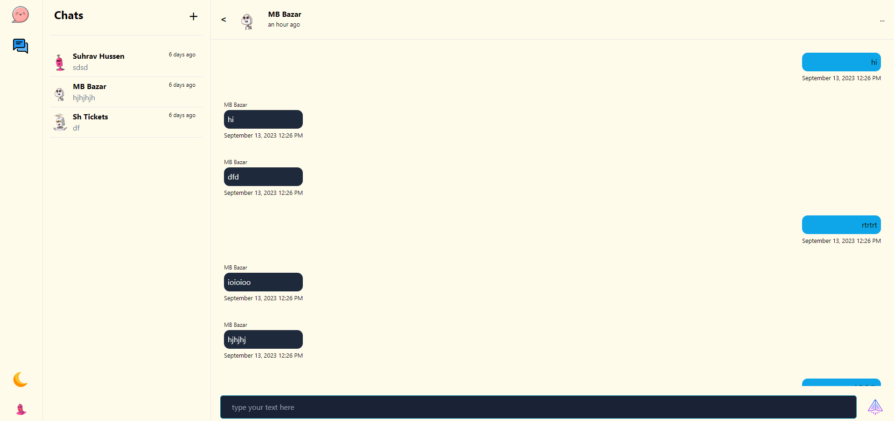
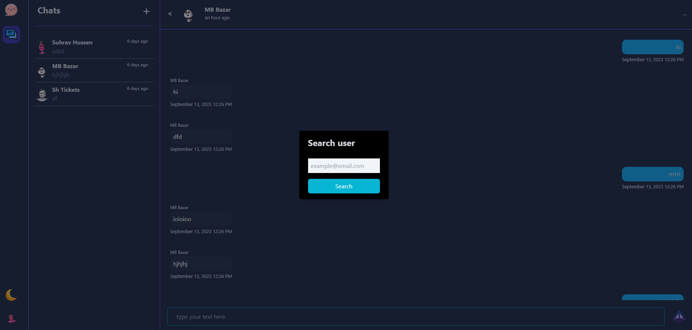
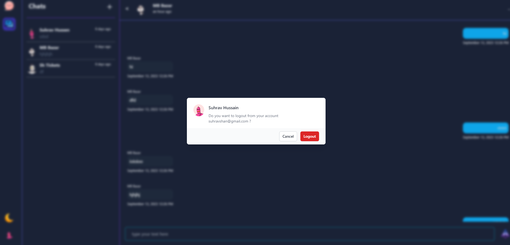

# CHATIFY Client

## _This is the front-end of chatify project. its a sveltekit-typescript project._

## Tech 🚀

I have used many technology to build this front end

- sveltekit
- Typescript
- tailwindcss
- firebase
- socket.io
- ✨ eslint , prettier ✨ etc

## Features 🔥

- Sign In with google
- Find your friends by their email
- realtime Chat

## LIVE 📗

**VISIT WEBSITE in [CHATIFY](https://chatify-sandy.vercel.app/)**

## IMAGES FROM WEBSITE

---

---

---

---

---

---

## 
